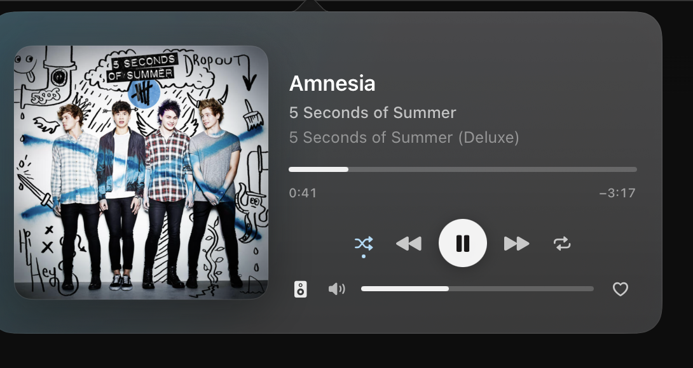
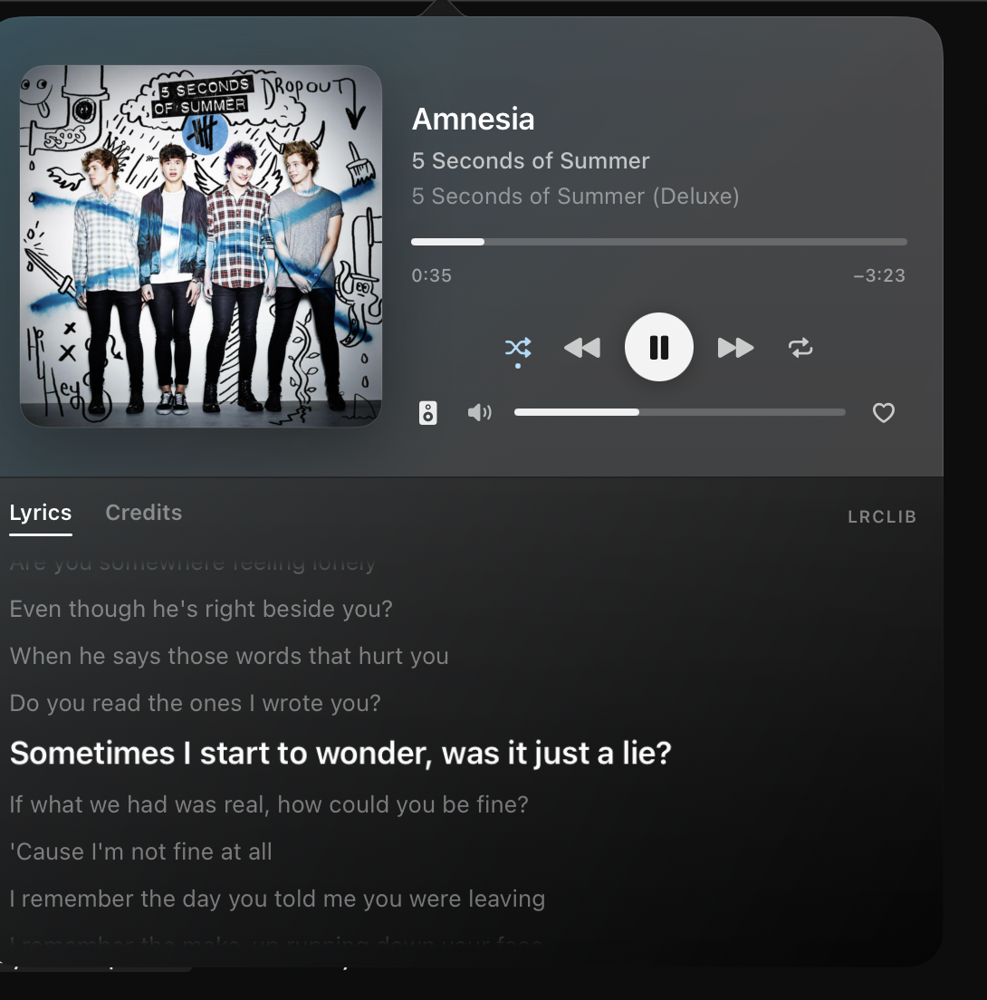
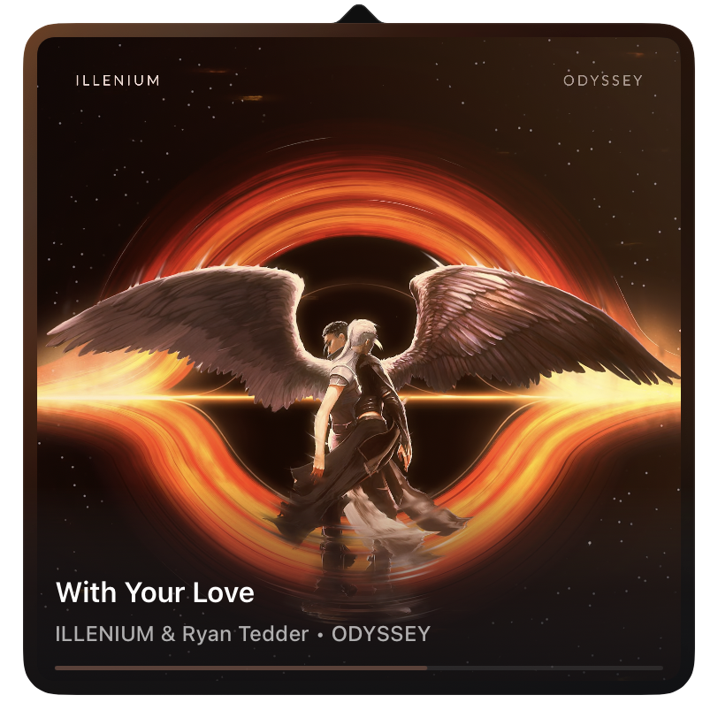

[](https://opensource.org/licenses/MIT) 
[](https://github.com/nbolar/PlayStatus/releases)
[](https://developer.apple.com/resources/)
[](https://developer.apple.com/swiftui/)
[](https://github.com/nbolar/playstatus/)
[](https://github.com/nbolar/PlayStatus/releases/latest/)

PlayStatus is a native SwiftUI macOS menu bar app for controlling Apple Music and Spotify without living in a full desktop window all day. The current generation of the app is a full SwiftUI relaunch with a richer now-playing surface, better onboarding, customizable display themes, provider-aware search, lyrics and credits, play history, Last.fm scrobbling, Shortcuts support, a detached floating player, and a cleaner settings flow.

## Why this version feels different

- The old AppKit utility-style player has been replaced with a layered SwiftUI player that supports regular, mini, and detached modes.
- New users get a guided walkthrough, and existing users can replay the full tour or the shorter "What's New" tour at any time.
- Lyrics, credits, and provider-aware search now live inside the main player instead of feeling like separate utility flows.
- Display tuning is much deeper: menu bar text modes, detached window sizing, theme presets, animated artwork, artwork motion styles, and progress-strip options all live in Settings.
- The app is more efficient when closed: media caches, onboarding previews, and heavy Settings surfaces can unload when they are not visible.
- PlayStatus now remembers what you played, scrobbles it to Last.fm, and can be driven from Shortcuts, Spotlight, or any launcher that can open a URL.

## What the app looks like now

Screenshots live in [`docs/screenshots`](docs/screenshots) so they version with the code.

### Regular player



One surface, not two. The album tints the room rather than painting it, the title outranks the
artist and album by two clear steps, and only the play button wears a shape — everything else is
a bare glyph that lights on hover.

#### Lyrics



Lyrics and credits open in a pane beneath the player, with the active line called out as it
plays and the source credited underneath.

### Mini player



The artwork is the window. Track details sit in a scrim that rises out of the art, and the
transport fades in when you point at it.

### Supports Animated Album Stream (if supported/exists)
https://github.com/user-attachments/assets/e12a56e8-de6e-460d-b323-5db9d491533c

### Settings


## First launch

1. Download the latest [release](https://github.com/nbolar/PlayStatus/releases/latest/) and move PlayStatus to `/Applications`.
2. Launch the app and choose which providers PlayStatus should listen to: Apple Music, Spotify, or both.
3. When macOS asks for Automation permission, allow PlayStatus to control Music and/or Spotify.
4. If no prompt appears, retry once and then check `System Settings -> Privacy & Security -> Automation`.
5. Use the walkthrough to set your preferred provider, display mode, theme, animated artwork, and launch-at-login behavior before closing the window.

### Install with Homebrew

PlayStatus is available from the official Homebrew tap. Install it with:

```sh
brew install --cask nbolar/playstatus/playstatus
```

Homebrew adds the `nbolar/playstatus` tap automatically.

PlayStatus uses Sparkle for normal in-app updates. If you deliberately want
Homebrew to replace an auto-updating cask, run:

```sh
brew upgrade --cask --greedy nbolar/playstatus/playstatus
```

## How people use PlayStatus day to day

### 1. Open the player from the menu bar

- Click the menu bar item to open the main player.
- Choose a menu bar display style in `Settings -> Display`: `Artist`, `Song`, `Artist + Song`, or `Icon Only`.
- Long titles can scroll, and title transitions can animate when tracks change.

### 2. Pick the right player surface

- `Regular mode` is the full player with artwork, inline search, progress, transport controls, lyrics, and credits.
- `Mini mode` is a calmer, more compact surface with quick controls and optional mini lyrics/credits.
- `Detached mode` turns the player into a floating standalone window. You can keep it always on top and choose `Small`, `Medium`, or `Large`.

### 3. Control playback quickly

- Use the transport controls for previous, play/pause, and next.
- Click the track title to jump straight into the source app.
- If Apple Music is the active source, you can favorite the current track from the player.
- The playback progress bar is seekable, and the menu bar can show a separate progress strip.

### 4. Use lyrics, credits, and search where they matter

- `Lyrics` and `Credits` open from the player instead of in separate utility views.
- Lyrics can come from Apple Music or LRCLIB depending on availability.
- Search is provider-aware:
  - Spotify opens the matching Spotify search.
  - Apple Music searches your Music library and can play a matching result.
- The mini player has its own quick lyrics and credits toggles.

### 5. Look back at what you've played

- `History` is a third tab beside `Lyrics` and `Credits`, in both the regular and mini player.
- One row per track, most recently played first. A track you've played repeatedly shows a `×N` count rather than filling the list with duplicates.
- Tracks you skipped early are recorded too, marked with a skip glyph.
- Click a row to play it again. Next then walks *up* the list — the tracks you played after it — and shuffles your library once it runs out.
- Right-click a row to copy it, open it in Music or Spotify, or remove it.
- History is stored on this Mac only and is never uploaded.

### 6. Scrobble to Last.fm

- Connect an account in `Settings -> Scrobbling`. PlayStatus opens Last.fm in your browser; your password is never entered into the app.
- A track scrobbles once you've heard half of it or four minutes, whichever comes first — the same rule Last.fm's own clients use.
- Scrobbles are sent the moment they're earned, not when the track ends, so quitting mid-track doesn't lose them.
- Your profile also shows what's playing right now, if you leave "now playing" updates on.
- If Last.fm is unreachable, plays queue up on this Mac and go out when it comes back. Nothing is lost by being offline.
- Scrobbling can be turned off per provider, or paused entirely without disconnecting.

### 7. Personalize the visual feel

- Theme presets: `Artwork Adaptive`, `Frosted`, `Midnight`, `Warm Studio`, `High Contrast`, `Graphite`.
- Animated artwork can use static motion, and supported tracks can use animated editorial streams.
- Artwork motion styles: `Parallax by Pointer`, `Vinyl Spin`, `Film Grain Drift`.
- Non-adaptive themes let you blend album colors back into the surface.

## Settings guide

### Display

- Menu bar text mode
- Parenthetical-title cleanup
- Scrollable titles
- Slide animation on track change
- Detached window always-on-top
- Detached window size preset
- Title width
- Artwork color intensity
- Theme selection
- Album color blend
- Animated artwork and animated artwork streams
- Animated stream quality and preview
- Artwork motion style preview

### Playback

- Preferred provider: `Auto`, `Music`, or `Spotify`
- Automatic provider priority when the preferred app is idle
- Enable or disable Apple Music and Spotify independently
- Expand the details pane automatically for new tracks

### Scrobbling

- Connect or disconnect a Last.fm account
- Enable or pause scrobbling without disconnecting
- Scrobble from Music and from Spotify, independently
- Send `now playing` updates
- Ignore tracks shorter than a chosen length
- Pending-scrobble count with a manual retry

### Hotkeys

Global shortcuts are configurable in `Settings -> Hotkeys`. Default bindings are:

| Action | Default |
| --- | --- |
| Play/Pause | `Ctrl+Opt+Cmd+P` |
| Next Track | `Ctrl+Opt+Cmd+N` |
| Previous Track | `Ctrl+Opt+Cmd+B` |
| Toggle Popover | `Ctrl+Opt+Cmd+O` |
| Toggle Favorite | `Ctrl+Opt+Cmd+L` |
| Toggle Detached Mode | `Ctrl+Opt+Cmd+D` |

### System

- Replay the full walkthrough
- Open the shorter `What's New` tour
- Temporarily re-arm `Debug Coachmarks` for QA or troubleshooting
- Launch at login
- Check for updates through Sparkle
- Clear the local media cache
- Reduce hidden memory usage when all surfaces are closed
- Record play history, and whether to include skipped tracks
- History retention limit, and clearing history

### License

- MIT license text
- LRCLIB attribution and disclaimer for third-party lyrics

## Automation

PlayStatus can be driven from Shortcuts, Spotlight, and anything that can open a URL — Raycast, Alfred, Stream Deck, a shell script, or `cron`. Nothing needs to be enabled first, and none of it brings the app to the foreground.

### Shortcuts and Spotlight

These actions appear under **PlayStatus** in Shortcuts.app:

| Action | Returns |
| --- | --- |
| Play or Pause | — |
| Next Track | — |
| Previous Track | — |
| Toggle Shuffle | Whether shuffle is now on |
| Cycle Repeat Mode | The new repeat mode |
| Toggle Favorite | Whether the track is now favorited |
| Set Output Volume | — |
| Show or Hide Player | — |
| Get Current Track | A track with title, artist, album, source, duration, playing state, and artwork |
| Get Recently Played | Recent tracks, newest first |

`Get Current Track` and `Get Recently Played` hand back artwork as a file, so it can flow straight into other Shortcuts actions.

Spotlight recognises spoken phrases for the common ones — "What's playing in PlayStatus", "Next track in PlayStatus", "Recently played in PlayStatus".

Actions that need a running player return a real error rather than doing nothing, so a Shortcut that fails is debuggable. `Toggle Favorite` is Apple Music only; Spotify's scripting interface has no equivalent.

### URL scheme

```
playstatus://playpause
playstatus://next
playstatus://previous
playstatus://favorite
playstatus://toggle              # show or hide the player
playstatus://shuffle
playstatus://repeat
playstatus://volume?level=35     # 0–100, or 0–1
playstatus://seek?seconds=90
```

Open one from a terminal with:

```sh
open "playstatus://next"
```

Unknown commands are ignored rather than reported — these arrive from scripts and launchers, where a dialog would be worse than doing nothing.

## Walkthrough and onboarding

The new SwiftUI version includes a dedicated walkthrough window for both first-run setup and returning-user upgrades.

- `Show Walkthrough` is also available from the app menu with `Cmd+Shift+/`.
- The full walkthrough helps with provider setup, Automation permissions, personalization, and hotkeys.
- The shorter `What's New` flow highlights the redesigned player, integrated lyrics/search, and the reorganized Settings experience.
- Contextual coachmarks can teach the search button, mode toggle, detached mode, detail toggles, and Settings navigation.

## Privacy, network use, and caching

- PlayStatus uses AppleScript to control Apple Music and Spotify, so macOS Automation permission is required.
- Lyrics may be fetched from LRCLIB, and artwork or animated artwork lookups may use public Apple/iTunes endpoints when needed.
- The media cache stores lyrics and artwork locally on your Mac and caps itself at 50 MB.
- Lyrics are third-party content and may be incomplete or unavailable.
- Play history is stored on this Mac and never uploaded. It holds up to 5,000 plays, trimmed oldest-first, and can be cleared from `Settings -> General`.
- Nothing is sent to Last.fm unless you connect an account. Scrobbling sends the track title, artist, album, duration, and the time the play started — the same fields any scrobbler sends.
- Your Last.fm session key is stored in the macOS Keychain, never in preferences. Disconnecting deletes it. PlayStatus never sees or stores your Last.fm password: sign-in happens on Last.fm's own site in your browser.
- Replaying a track from history stages a playlist named `PlayStatus Queue` in your Music library, reused and overwritten each time. With iCloud Music Library enabled it will sync to your other devices.

## Compatibility

- Minimum supported macOS version: `15.0`
- Supported providers: `Apple Music`, `Spotify`
- Update flow: Sparkle-based in-app update checks remain supported
- License: `MIT`
